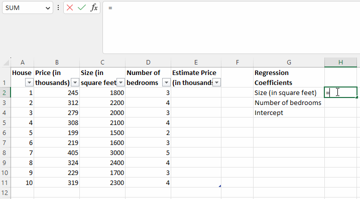
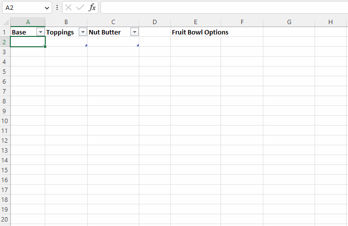
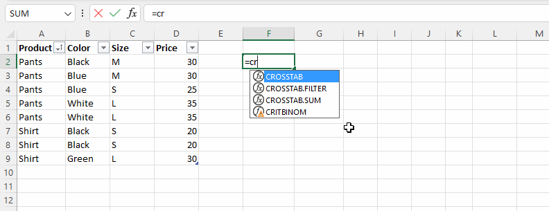
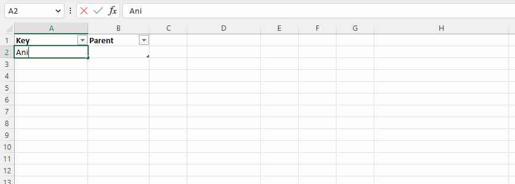

# Excel snippet collection

This library contains a collection of lambda functions and macros that can be used in Microsoft Excel.

## Adding functions into Excel Workbook

There are two ways to import the lambda functions listed here into your Excel workbook:

1. Manually copy and paste them into the workbook's name manager one by one.
2. Use the macro `AddLambdaNamedRangesFromFile` to import multiple lambdas programmatically.

### Importing functions programmatically

Follow these steps to import the lambda functions programmatically:

1. Import the module ExcelLambdaImport.bas into your workbook.
2. Call the macro `AddLambdaNamedRangesFromFile` and specify the lambda functions to import.

Here is an example of how to use the `AddLambdaNamedRangesFromFile` macro to import two lambda functions at once:

```vbnet
AddLambdaNamedRangesFromFile(Array("TEXTREPLACE", "CARTESIANPRODUCT"))
```

## Lambda functions

### Ordinary least squares



```
# OLS

y: m x 1
X: m x n
returns: m x 1

=LAMBDA(y,X,MMULT(MMULT(MINVERSE(MMULT(TRANSPOSE(X),X)),TRANSPOSE(X)),y))
```

### Bounded variable least squares (implemented using gradient descent)

```
# BVLS - using recursion

y: m x 1
X: m x n
lbound: m x 1
ubound: m x 1
learning_rate: number, e.g. 0.00004
iterations: number, e.g. 50
w: m x 1
returns: m x 1

=LAMBDA(y,X,lbound,ubound,learning_rate,iterations,w,
  IF(iterations=0,w,
    LET(
      _ones_m,SEQUENCE(ROWS(X),,1,0),
      _ones_n,SEQUENCE(COLUMNS(X),,1,0),
      _w,IF(ROWS(w)=COLUMNS(X),w,SUM(y)/SUM(MMULT(X,_ones_n))*_ones_n),
      w_ols,_w-learning_rate*MMULT(TRANSPOSE((MMULT(X,_w)-y)*X),_ones_m)/ROWS(X),
      w_lbounded,IF(ROWS(lbound)=COLUMNS(X),IF(w_ols<lbound,lbound,w_ols),w_ols),
      w_bounded,IF(ROWS(ubound)=COLUMNS(X),IF(w_lbounded>ubound,ubound,w_lbounded),w_lbounded),
      BVLS(y,X,lbound,ubound,learning_rate,iterations-1,w_bounded))))


# BVLS - using loop

y: m x 1
X: m x n
lbound: m x 1
ubound: m x 1
iterations: number, e.g. 1000
learning_rate: number, e.g. 0.04
returns: m x 1

=LAMBDA(y,X,lbound,ubound,iterations,learning_rate,
  LET(
    x_max,BYCOL(X,LAMBDA(v,MAX(v))),
    y_max,BYCOL(y,LAMBDA(v,MAX(v))),
    _ones_m,SEQUENCE(ROWS(X),,1,0),
    _ones_n,SEQUENCE(COLUMNS(X),,1,0),
    _y,y/y_max,
    _X,X/x_max,
    _w,SUM(_y)/SUM(MMULT(_X,_ones_n))*_ones_n,
    _iterations,IF(iterations=0,200,iterations),
    _learning_rate,IF(learning_rate=0,0.025,learning_rate),
    GRADIENT_DESCENT_BVLS,LAMBDA(w,_,
      LET(
        w_ols,w-_learning_rate*MMULT(TRANSPOSE((MMULT(_X,w)-_y)*_X),_ones_m)/ROWS(_X),
        w_lbounded,IF(ROWS(lbound)=COLUMNS(_X),IF(w_ols<lbound,lbound,w_ols),w_ols),
        w_bounded,IF(ROWS(ubound)=COLUMNS(_X),IF(w_lbounded>ubound,ubound,w_lbounded),w_lbounded),
        w_bounded)),
    TRANSPOSE(y_max/x_max)*REDUCE(_w,SEQUENCE(_iterations),GRADIENT_DESCENT_BVLS)))
```

### Constrained least squares

```
# CLS

=LAMBDA(y,X,[constraint_function],[w],[iterations],[a],[b_1],[b_2],[e],
  LET(
    iterations,IF(ISOMITTED(iterations),1000,iterations),
    a,IF(ISOMITTED(a),0.001,a),
    b_1,IF(ISOMITTED(b_1),0.9,b_1),
    b_2,IF(ISOMITTED(b_2),0.999,b_2),
    e,IF(ISOMITTED(e),0.00000001,e),
    y_max,BYCOL(ABS(y),LAMBDA(v,MAX(v))),
    x_max,BYCOL(ABS(X),LAMBDA(v,MAX(v))),
    _ones_m,SEQUENCE(ROWS(X),,1,0),
    _ones_n,SEQUENCE(COLUMNS(X),,1,0),
    _y,y/y_max,
    _X,X/x_max,
    scale_w,TRANSPOSE(x_max/y_max),
    scale_w_inv,TRANSPOSE(y_max/x_max),
    w,IF(ISOMITTED(w),SUM(_y)/SUM(MMULT(_X,_ones_n))*_ones_n,scale_w*w),
    m,SEQUENCE(ROWS(w),COLUMNS(w),0,0),
    v,SEQUENCE(ROWS(w),COLUMNS(w),0,0),
    state,HSTACK(HSTACK(m,v),w),
    ADAM,LAMBDA(state,t,
      LET(
        _m,INDEX(state,SEQUENCE(ROWS(state)),1),
        _v,INDEX(state,SEQUENCE(ROWS(state)),2),
        _w,INDEX(state,SEQUENCE(ROWS(state)),3),
        g,MMULT(TRANSPOSE((MMULT(_X,_w)-_y)*_X),_ones_m),
        m,b_1*_m+(1-b_1)*g,
        v,b_2*_v+(1-b_2)*(g^2),
        _a,a*SQRT(1-b_2^t)/(1-b_1^t),
        g_adam,m/(SQRT(v)+e),
        w_ols,_w-_a*g_adam,
        w,IF(ISOMITTED(constraint_function),w_ols,scale_w*constraint_function(scale_w_inv*w_ols,scale_w_inv*g_adam,_a,scale_w_inv)),
        CHOOSE({1,2,3},m,v,w))),
    result,REDUCE(state,SEQUENCE(iterations,,1),ADAM),
    scale_w_inv*INDEX(result,SEQUENCE(ROWS(result)),3)))


# BOX_CONSTRAINT

=LAMBDA(lbound,ubound,
  LAMBDA(w,g,a,scale_w_inv,
    LET(
      w_lbounded,IF(w<lbound,lbound,w),
      IF(w_lbounded>ubound,ubound,w_lbounded))))

# LASSO_CONSTRAINT

=LAMBDA(reg,
  LAMBDA(w,g,a,scale_w_inv,
    LET(
      w_reg,ABS(w)-reg*a*scale_w_inv,
      IF(w_reg>0,w_reg,0)*SIGN(w))))

# COMBINE_CONSTRAINTS

=LAMBDA(constraint_1, constraint_2,
  LAMBDA(w,g,a,scale_w_inv,
    LET(
      w_1,constraint_1(w,g,a,scale_w_inv),
      w_2,constraint_2(w_1,g,a,scale_w_inv),
      w_2)))
```

### Lookup table column values

```
# CLOOKUP

table: m x n
colname: string
returns m x n_out

=LAMBDA(table,colname,
  INDEX(table,SEQUENCE(ROWS(table)-1)+1,MATCH(colname,INDEX(table,1,SEQUENCE(,COLUMNS(table))),0)))

```

### Fast operations for sorted data

**Documentation**  
[FILTER_BETWEEN_SORTED_ASC](docs/filter-between-sorted-asc.md)

```
# XMATCH_BYROW_SORTED_ASC

=LAMBDA(lookup_value,lookup_range,
  LET(
    n_cols,COLUMNS(lookup_value),
    \1,"Use binary search to find match in first lookup column",
    first_rows,XMATCH(INDEX(lookup_value,,1),INDEX(lookup_range,,1),0,2),
    IF(n_cols=1,first_rows,LET(
      \2,"Use linear search to find matches in remaining columns",
      seq_cols,SEQUENCE(n_cols-1,,2),
      n_rows,ROWS(lookup_value),
      seq_rows,SEQUENCE(n_rows),
      MAP(seq_rows,LAMBDA(i,LET(
        first_row,INDEX(first_rows,i,1),
        keys,INDEX(lookup_value,i,),
        match_row,1+REDUCE(first_row-1,seq_cols,
          LAMBDA(r,c,
            INDEX(r,1,1)-1+XMATCH(INDEX(keys,1,c),DROP(INDEX(lookup_range,,c),INDEX(r,1,1)),1,1))),
         is_match,AND(keys=INDEX(lookup_range,match_row)),
         IF(is_match,match_row,NA()))))))))

# FILTER_BETWEEN_SORTED_ASC

=LAMBDA(range,sorted_criteria_range,criteria_from,criteria_to,
  LET(
    first_row,XMATCH(criteria_from,sorted_criteria_range,0,2),
    IF(ISNA(first_row),NA(),
      LET(
        last_row,XMATCH(criteria_to,sorted_criteria_range,-1,-1),
        first_cell,INDEX(range,first_row,1),
        last_cell,INDEX(range,last_row,1),
        first_cell:last_cell))))

# INDEXOF_UNIQUE_SORTED_ASC

=LAMBDA(sorted_keys,
  LET(
    n_keys,ROWS(sorted_keys),
    seq,SEQUENCE(n_keys-1,,2),
    VSTACK(1,FILTER(seq,MAP(seq,
      LAMBDA(i,OR(INDEX(sorted_keys,i,)<>INDEX(sorted_keys,i-1,))))),n_keys+1)))

```

### Text functions

**Documentation**  
[TEXTREPLACE](docs/textreplace.md)

```
# TEXTCONTAINSANY

find_text: string | string[]
within_text: string
case_sensitive: boolean
returns: boolean

=LAMBDA(find_text,within_text,[case_sensitive],
  LET(
    case_sensitive,IF(ISOMITTED(case_sensitive),FALSE),
    OR(NOT(ISERROR(SEARCH("*"&find_text&"*",within_text))))))


# TEXTREPLACE

=LAMBDA(text,old_text_new_text_alternating_array,
  LET(
    pairs,WRAPROWS(TOROW(old_text_new_text_alternating_array),2),
    seq,SEQUENCE(ROWS(pairs)),
    REDUCE(text,seq,LAMBDA(result,r,SUBSTITUTE(result,INDEX(pairs,r,1),INDEX(pairs,r,2))))))

# LONGESTCOMMONSUBSTRING

=LAMBDA(text_1,text_2,
  LET(
    len_1,LEN(text_1),
    len_2,LEN(text_2),
    matches,MAKEARRAY(len_2,len_1,LAMBDA(i,j,MID(text_2,i,1)=MID(text_1,j,1))),
    n_diag,len_1+len_2-1,
    len_longest_diag,MIN(len_1,len_2),
    MAX(MAKEARRAY(n_diag,1,LAMBDA(i_diag,_,LET(
      i_first,IF(i_diag<=len_1,1,i_diag-len_1+1),
      j_first,IF(i_first>1,1,len_1-i_diag+1),
      len_diag,MIN(len_longest_diag,len_2-i_first+1,len_1-j_first+1),
      MAX(SCAN(0,SEQUENCE(len_diag,,0),LAMBDA(z,k,IF(INDEX(matches,i_first+k,j_first+k),z+1,0))))))))))


```

### Data manipulation

```

# MAPROWS

=LAMBDA(data,func,
  REDUCE(
    func(INDEX(data,1,)),
    SEQUENCE(ROWS(data)-1,,2),
    LAMBDA(result,idx,IFNA(VSTACK(result,func(INDEX(data,idx,))),result))))


# APPLYWHILE

=LAMBDA(initial_value,cond_func,func,
  IF(cond_func(initial_value),
    APPLYWHILE(func(initial_value),cond_func,func),
    initial_value))

```

### Cartesian product



**Documentation**  
[CARTESIANPRODUCT](docs/cartesianproduct.md)

```
# CARTESIANPRODUCT

=LAMBDA(a_1,[a_2],[a_3],[a_4],[a_5],[a_6],[a_7],[a_8],[a_9],
  LET(
    cartesian_prod,LAMBDA(set_1,[set_2],
      IF(ISOMITTED(set_2),
        set_1,
        LET(
          rows_1,ROWS(set_1),
          rows_2,ROWS(set_2),
          cols_1,COLUMNS(set_1),
          cols_2,COLUMNS(set_2),
          MAKEARRAY(rows_1*rows_2,cols_1+cols_2,
            LAMBDA(row,col,
              IF(col<=cols_1,
                INDEX(set_1,FLOOR.MATH((row-1)/rows_2)+1,col),
                INDEX(set_2,MOD(row-1,rows_2)+1,col-cols_1))))))),
    cartesian_prod(
      cartesian_prod(
        cartesian_prod(
          cartesian_prod(
            cartesian_prod(
              cartesian_prod(
                cartesian_prod(
                  cartesian_prod(a_1,a_2),a_3),a_4),a_5),a_6),a_7),a_8),a_9)))


# SPLIT.CARTESIANPRODUCT

=LAMBDA(delimiter,arg_1,[arg_2],[arg_3],[arg_4],[arg_5],[arg_6],[arg_7],[arg_8],[arg_9],
  LET(
    split,LAMBDA(x,TEXTSPLIT(x,,delimiter)),
    n_args,IFS(
      ISOMITTED(arg_2),1,
      ISOMITTED(arg_3),2,
      ISOMITTED(arg_4),3,
      ISOMITTED(arg_5),4,
      ISOMITTED(arg_6),5,
      ISOMITTED(arg_7),6,
      ISOMITTED(arg_8),7,
      ISOMITTED(arg_9),8,
      TRUE,9),
    CHOOSE(n_args,
      split(arg_1),
      CARTESIANPRODUCT(split(arg_1),split(arg_2)),
      CARTESIANPRODUCT(split(arg_1),split(arg_2),split(arg_3)),
      CARTESIANPRODUCT(split(arg_1),split(arg_2),split(arg_3),split(arg_4)),
      CARTESIANPRODUCT(split(arg_1),split(arg_2),split(arg_3),split(arg_4),split(arg_5)),
      CARTESIANPRODUCT(split(arg_1),split(arg_2),split(arg_3),split(arg_4),split(arg_5),split(arg_6)),
      CARTESIANPRODUCT(split(arg_1),split(arg_2),split(arg_3),split(arg_4),split(arg_5),split(arg_6),split(arg_7)),
      CARTESIANPRODUCT(split(arg_1),split(arg_2),split(arg_3),split(arg_4),split(arg_5),split(arg_6),split(arg_7),split(arg_8)),
      CARTESIANPRODUCT(split(arg_1),split(arg_2),split(arg_3),split(arg_4),split(arg_5),split(arg_6),split(arg_7),split(arg_8),split(arg_9)))))


# MAPARGS

=LAMBDA(args,func,
  LET(
    get,LAMBDA(arr,col,INDEX(arr,,col)),
    n_args,COLUMNS(args),
    CHOOSE(n_args,
      MAP(get(args,1),func),
      MAP(get(args,1),get(args,2),func),
      MAP(get(args,1),get(args,2),get(args,3),func),
      MAP(get(args,1),get(args,2),get(args,3),get(args,4),func),
      MAP(get(args,1),get(args,2),get(args,3),get(args,4),get(args,5),func),
      MAP(get(args,1),get(args,2),get(args,3),get(args,4),get(args,5),get(args,6),func),
      MAP(get(args,1),get(args,2),get(args,3),get(args,4),get(args,5),get(args,6),get(args,7),func),
      MAP(get(args,1),get(args,2),get(args,3),get(args,4),get(args,5),get(args,6),get(args,7),get(args,8),func),
      MAP(get(args,1),get(args,2),get(args,3),get(args,4),get(args,5),get(args,6),get(args,7),get(args,8),get(args,9)),func)))

```

### Crosstab



```
# CROSSTAB

=LAMBDA(table,[row_fields],[column_fields],[value_fields],[agg_func],[na_value],
  LET(
    min_column_count,IF(ISOMITTED(agg_func),0,1),
    vec_row_fields,TOCOL(row_fields),
    vec_column_fields,TOCOL(column_fields),
    vec_value_fields,TOCOL(value_fields),
    headers,INDEX(table,1,),
    row_idx,XMATCH(vec_row_fields,headers),
    column_idx,XMATCH(vec_column_fields,headers),
    value_idx,XMATCH(vec_value_fields,headers),
    n_row_fields,IF(ISOMITTED(row_fields),0,ROWS(row_idx)),
    n_column_fields,IF(ISOMITTED(column_fields),0,ROWS(column_idx)),
    n_value_fields,IF(ISOMITTED(value_fields),0,ROWS(value_idx)),
    key_idx,UNIQUE(IFS(
      n_row_fields=0,column_idx,
      n_column_fields=0,row_idx,
      TRUE,VSTACK(row_idx,column_idx))),
    data,SORT(DROP(table,1),key_idx),
    n_data,ROWS(data),
    keys,CHOOSECOLS(data,key_idx),
    uq_keys_idx,INDEXOF_UNIQUE_SORTED_ASC(keys),
    values,CHOOSECOLS(data,value_idx),
    results,MAP(
      DROP(uq_keys_idx,-1),
      DROP(uq_keys_idx,1),
      LAMBDA(idx_first,idx_next,
        LET(
          data_subset,TAKE(DROP(data,idx_first-1),idx_next-idx_first),
          values_subset,TAKE(DROP(values,idx_first-1),idx_next-idx_first),
          key_args,INDEX(keys,idx_first,),
          agg_func(values_subset,data_subset,key_args)))),
    row_keys,UNIQUE(CHOOSECOLS(data,row_idx)),
    column_keys,UNIQUE(CHOOSECOLS(data,column_idx)),
    n_row_keys,IF(ISOMITTED(row_fields),0,ROWS(row_keys)),
    n_column_keys,IF(ISOMITTED(column_fields),0,ROWS(column_keys)),
    n_key_fields,ROWS(key_idx),
    seq_key_fields,SEQUENCE(n_key_fields-1,,2),
    keys_and_results,HSTACK(UNIQUE(keys),results),
    lookup_result,LAMBDA(key,LET(
      key_row,XMATCH_BYROW_SORTED_ASC(key,TAKE(keys_and_results,,n_key_fields)),
      key_and_result,INDEX(keys_and_results,INDEX(key_row,1,1),),
      IFNA(DROP(key_and_result,,n_key_fields),na_value))),
    MAKEARRAY(
      n_column_fields+MAX(min_column_count,n_row_keys),
      n_row_fields+MAX(min_column_count,n_column_keys),
      LAMBDA(r,c,
        IFS(
          AND(r<=n_column_fields,c<=n_row_fields),"",
          r<=n_column_fields,INDEX(column_keys,c-n_row_fields,r),
          c<=n_row_fields,INDEX(row_keys,r-n_column_fields,c),
          ISOMITTED(value_func),"",
          TRUE,LET(
            row_key,TOROW(INDEX(row_keys,r-n_column_fields,)),
            column_key,TOROW(INDEX(column_keys,c-n_row_fields,)),
            key,IFS(
              n_row_fields=0,column_key,
              n_column_fields=0,row_key,
              TRUE,HSTACK(row_key,column_key)),
            lookup_result(key)))))))


# CROSSTAB.SUM

=LAMBDA(values,data,keys,SUM(values))


# CROSSTAB.FILTER

=LAMBDA(predicate,agg_func,
  LAMBDA(values,data,keys,LET(
    condition,BYROW(data,predicate),
    agg_func(FILTER(values,condition,0),FILTER(data,condition,0),keys))))

```

### Hierarchies



```

# HIERARCHIZE

=LAMBDA(root,keys,parents,[sort_keys],[max_level],[level],[filter_key_predicate],
  LET(
    parents,IF(ISOMITTED(sort_keys),parents,SORTBY(parents,sort_keys)),
    keys,IF(ISOMITTED(sort_keys),keys,SORTBY(keys,sort_keys)),
    level,IF(ISOMITTED(level),0,level),
    children,UNIQUE(FILTER(keys,parents=root,NA())),
    is_last_level,NOT(OR(ISOMITTED(max_level),level<max_level)),
    is_leaf,ISNA(INDEX(children,1,1)),
    is_excluded,IF(ISOMITTED(filter_key_predicate),FALSE,NOT(filter_key_predicate(root))),
    record,HSTACK(root,level,is_leaf),
    IF(OR(is_leaf,is_last_level),
      IF(is_excluded,NA(),record),
      LET(
        get_descendants_with_levels,LAMBDA(result,child,LET(
          descendant_hierarchy,HIERARCHIZE(child,keys,parents,,max_level,level+NOT(is_excluded),filter_key_predicate),
          IF(ISNA(INDEX(descendant_hierarchy,1,1)),result,VSTACK(result,descendant_hierarchy))
        )),
        hierarchy,REDUCE(record,children,get_descendants_with_levels),
        IF(is_excluded,
          IF(ROWS(hierarchy)=1,
            NA(),
            DROP(hierarchy,1)),
          hierarchy)
      ))))


# HIERARCHY_GET

=LAMBDA(hierarchy,key,
  LET(
    key_row,XMATCH(key,INDEX(hierarchy,,1)),
    level,INDEX(hierarchy,key_row,2),
    records_from,DROP(hierarchy,key_row-1),
    records_after,DROP(records_from,1),
    next_non_descendant_row,XMATCH(level,INDEX(records_after,,2),-1),
    extracted_hierarchy,IFS(
      key_row=1,hierarchy,
      ISERROR(next_non_descendant_row),records_from,
      TRUE,TAKE(records_from,next_non_descendant_row-1)),
    adjusted_hierarchy,HSTACK(
      INDEX(extracted_hierarchy,,1),
      INDEX(extracted_hierarchy,,2)-level,
      INDEX(extracted_hierarchy,,3)),
      adjusted_hierarchy))


# HIERARCHY_REMOVE

=LAMBDA(hierarchy,remove_key,
  LET(
    key_row,XMATCH(remove_key,INDEX(hierarchy,,1)),
    level,INDEX(hierarchy,key_row,2),
    valid_records_before,TAKE(hierarchy,key_row-1),
    records_after,DROP(hierarchy,key_row),
    next_non_descendant_row,XMATCH(level,INDEX(records_after,,2),-1),
    valid_records_after,DROP(records_after,next_non_descendant_row-1),
    IFS(
      key_row=1,valid_records_after,
      ISERROR(next_non_descendant_row),valid_records_before,
      TRUE,VSTACK(valid_records_before,valid_records_before))))


# HIERARCHY_INSERT

=LAMBDA(base_hierarchy,insert_at_key,insert_hierarchy,[as_sibling],
  LET(
    as_sibling,IF(ISOMITTED(as_sibling),FALSE,as_sibling),
    key_row,XMATCH(insert_at_key,INDEX(base_hierarchy,,1)),
    level,INDEX(base_hierarchy,key_row,2),
    insert_hierarchy_root_level,INDEX(insert_hierarchy,1,2),
    adjusted_insert_hierarchy,HSTACK(
      INDEX(insert_hierarchy,,1),
      INDEX(insert_hierarchy,,2)-insert_hierarchy_root_level+level+IF(as_sibling,0,1),
      INDEX(insert_hierarchy,,3)),
    records_before,TAKE(base_hierarchy,key_row),
    records_after,DROP(base_hierarchy,key_row),
    IF(key_row=ROWS(base_hierarchy),
      VSTACK(records_before,adjusted_insert_hierarchy),
      VSTACK(records_before,adjusted_insert_hierarchy,records_after))))


# HIERARCHY_TREE

=LAMBDA(hierarchy,
  LET(
    tok_last_indent,"   ",
    tok_middle_indent,"│  ",
    tok_last_branch,"└─ ",
    tok_middle_branch,"├─ ",
    len_tok,LEN(tok_last_indent),
    root,INDEX(hierarchy,1,1),
    n_rows,ROWS(hierarchy),
    reversed_indexes,SEQUENCE(n_rows-2,,n_rows-1,-1),
    last_key,INDEX(hierarchy,n_rows,1),
    last_level,INDEX(hierarchy,n_rows,2),
    last_node,REPT(tok_last_indent,last_level-1)&tok_last_branch&last_key,
    tree,REDUCE(last_node,reversed_indexes,LAMBDA(tree,idx,
      LET(
        key,INDEX(hierarchy,idx,1),
        level,INDEX(hierarchy,idx,2),
        next,INDEX(tree,1,1),
        next_level,INDEX(hierarchy,idx+1,2),
        common_level,MIN(level,next_level),
        next_parts,MID(next,SEQUENCE(common_level,,1,len_tok),len_tok),
        common_parts,SUBSTITUTE(SUBSTITUTE(next_parts,tok_last_branch,tok_middle_indent),tok_middle_branch,tok_middle_indent),
        stem,IF(level=1,"",TEXTJOIN("",FALSE,TAKE(common_parts,level-1)))&REPT(tok_last_indent,MAX(0,level-common_level-1)),
        next_part_on_same_level,IFERROR(INDEX(next_parts,level),tok_last_indent),
        has_no_more_siblings,OR(level>next_level,next_part_on_same_level=tok_last_indent),
        node,stem&IF(has_no_more_siblings,tok_last_branch,tok_middle_branch)&key,
        VSTACK(node,tree)))),
    SWITCH(n_rows,
      1,root,
      2,VSTACK(root,last_node),
      VSTACK(root,tree)
    )))


# HIERARCHY_TREE_KEYS

=LAMBDA(tree,TEXTAFTER(tree,"─ ",1,,,tree))


```

### Data preparation

```
# PREPARECOLS

=LAMBDA(table,colname,[coltype],[data_table],
  LET(
    data_table,IF(ISOMITTED(data_table),table,data_table),
    colname,TRANSPOSE(TEXTSPLIT(colname,",")),
    A,CLOOKUP(table,colname),
    B,CLOOKUP(data_table,colname),

    IF(ISOMITTED(coltype),
      VSTACK(colname,B),

    IF(ISNONTEXT(coltype),LET(
      data,IF(COLUMNS(B)>1,BYROW(B,coltype),MAP(B,coltype)),
      VSTACK(colname,data)),

    SWITCH(coltype,
      "intercept",LET(
        data,SEQUENCE(ROWS(data_table)-1,,1,0),
        VSTACK(colname,data)),

      "classification",LET(
        classifications,TRANSPOSE(DROP(SORT(UNIQUE(A)),1)),
        colnames,colname&"_"&classifications,
        data,N(B=classifications),
        VSTACK(colnames,data)),

      "number+dummy",LET(
        colnames,CHOOSE({1,2},colname&"_dummy",colname&"_value"),
        data,CHOOSE({1,2},N(ISNUMBER(--B)),IF(ISNUMBER(--B),--B,0)),
        VSTACK(colnames,data)),

      "distance-from-max",LET(
        data,MAX(A)-B,
        VSTACK(colname,data)),

      "distance-from-max+dummy",LET(
        colnames,CHOOSE({1,2},colname&"_dummy",colname&"_value"),
        data,CHOOSE({1,2},N(ISNUMBER(--B)),IF(ISNUMBER(--B),MAX(FILTER(--A,ISNUMBER(--A)))-B,0)),
        VSTACK(colnames,data)),

      NA())))))
```

### Resampling

```
# RANDOMARRAY

m: number
seed: number
returns: m x 1

=LAMBDA([m],[seed],
  LET(
    m,IF(ISOMITTED(m),1,m),
    seed,IF(ISOMITTED(seed),1234,seed),
    lcg_parkmiller,LAMBDA(seed,i,MOD(48271*seed,2^31-1)),
    DROP(SCAN(seed,SEQUENCE(m+1),lcg_parkmiller),1)/(2^31-1)))


# SAMPLE

A: m_a x n
m: number
replacement: logical
seed: number
returns: m x n

=LAMBDA(A,[m],[replacement],[seed],
  LET(
    m_a,ROWS(A),
    replacement,IF(ISOMITTED(replacement),IF(ISOMITTED(m),TRUE,FALSE),replacement),
    m,IF(ISOMITTED(m),m_a,m),
    seed,IF(ISOMITTED(seed),1234,seed),
    INDEX(A,IF(replacement,
      RANDOMARRAY(m,seed)*(m_a-1)+1,
      TAKE(SORTBY(SEQUENCE(m_a),RANDOMARRAY(m_a,seed)),m)),SEQUENCE(,COLUMNS(A)))))


# BOOTSTRAP

TODO: nested arrays are not supported

=LAMBDA(y,X,function,r,[seed],
  LET(
    y_X,HSTACK(y,X),
    seed,IF(ISOMITTED(seed),1234,seed),
    SCAN(0,SEQUENCE(r,,seed),LAMBDA(a,seed,LET(
      s,SAMPLE(y_X,,,seed),
      y,TAKE(s,,1),
      X,DROP(s,,1),
      function(y,X))))))


```

### Miscellaneous

#### Hyperlink

```

# LINKADDRESS

=LAMBDA(row_num,column_num,[sheet_name],[workbook_name],
  LET(
    workbook_name,IF(ISOMITTED(workbook_name),
      LET(
        filename,CELL("filename"),
        opening_bracket,FIND("[",filename),
        closing_bracket,FIND("]",filename,opening_bracket),
        IF(filename="","[Book1]",MID(filename,opening_bracket,closing_bracket-opening_bracket+1))),
      "["&workbook_name&"]"),
    workbook_name&ADDRESS(row_num,column_num,1,1,sheet_name)))

```

#### SEO related functions

```

# CLUSTER_KEYWORDS

=LAMBDA(keywords,urls,[match_count],
  LET(
    match_count,IF(ISOMITTED(match_count),4,match_count),

    \1,"Helper functions",
    get_row,LAMBDA(table,i,INDEX(table,i,SEQUENCE(,COLUMNS(table)))),

    \2,"Clustering",
    uq_keywords,UNIQUE(keywords),
    uq_urls,UNIQUE(urls),
    len_keywords,LEN(uq_keywords),
    count_keywords,ROWS(uq_keywords),
    sorted_keywords,SORTBY(uq_keywords,len_keywords),
    seq,SEQUENCE(count_keywords),
    keyword_pair_common_url_count_matrix,COUNTIFS(urls,uq_urls,keywords,TRANSPOSE(sorted_keywords)),
    keyword_pair_mask_matrix,MMULT(TRANSPOSE(keyword_pair_common_url_count_matrix),keyword_pair_common_url_count_matrix)>=match_count,
    keyword_match_count,MMULT(--keyword_pair_mask_matrix,SEQUENCE(COLUMNS(keyword_pair_mask_matrix),,1,0)),
    keyword_pair_matrix,SORTBY(TRANSPOSE(IF(keyword_pair_mask_matrix,sorted_keywords,"")),keyword_match_count,-1),
    clusters_matrix,merge_rows_with_overlap(keyword_pair_matrix),
    cluster_size,BYROW(clusters_matrix,LAMBDA(cluster,SUM(--(cluster<>"")))),
    clusters,FILTER(clusters_matrix,cluster_size>1),
    no_clusters,FILTER(clusters_matrix,cluster_size=1),
    no_cluster_row,REDUCE(get_row(no_clusters,1),SEQUENCE(ROWS(no_clusters)-1,,2),LAMBDA(agg_row,i,LET(
      current_row,get_row(no_clusters,i),
      IF(current_row="",agg_row,current_row)))),
    clusters_all,VSTACK(clusters,no_cluster_row),
    empty_column,INDEX("",SEQUENCE(ROWS(clusters_all)-1,,,0)),
    extra_column_for_no_cluster,VSTACK(empty_column,"(no cluster)"),
    result_matrix,HSTACK(extra_column_for_no_cluster,clusters_all),
    clusters_text,BYROW(result_matrix,LAMBDA(cluster,TEXTJOIN(", ",TRUE,cluster))),
    clusters_text))

# merge_rows_with_overlap (required helper function)

=LAMBDA(table,LET(
  get_row,LAMBDA(table,i,INDEX(table,i,SEQUENCE(,COLUMNS(table)))),
  merge_row,LAMBDA(table,row_values,i,LET(
    cols,SEQUENCE(,COLUMNS(table)),
    seq,SEQUENCE(ROWS(table)),
    r,IF(row_values="",INDEX(table,i,cols),row_values),
    IF(seq=i,r,table))),
  initial_table,get_row(table,1),
  REDUCE(initial_table,SEQUENCE(ROWS(table)-1,,2),LAMBDA(agg_table,i,LET(
    current_row,get_row(table,i),
    seq_agg_table,SEQUENCE(ROWS(agg_table)),
    overlapping_rows_mask,MAP(seq_agg_table,LAMBDA(agg_i,LET(
      agg_row,get_row(agg_table,agg_i),
      agg_row_x,IF(agg_row="",-1,agg_row),
      OR(agg_row_x=current_row)))),
    overlap_exists,OR(overlapping_rows_mask),
    IF(overlap_exists,
      LET(
        first_overlapping_row_index,XMATCH(TRUE,overlapping_rows_mask),
        merge_row(agg_table,current_row,first_overlapping_row_index)),
      VSTACK(agg_table,current_row))
  )))))

```

## VBA Macros

```vb

' For each item in `sheetNames` array, copy `wsTemplate` and call a macro with name `callbackName`
' Usage:
'   CopySheetWithParams ActiveSheet, "CopySheetWithParams_Callback_Example", Array("NewSheet1", "NewSheet2")
'
Sub CopySheetWithParams( _
    ByVal wsTemplate As Worksheet, _
    ByVal callbackName As String, _
    ByVal sheetNames As Variant, _
    Optional ByVal Before As Worksheet, _
    Optional ByVal After As Worksheet)

    Dim displayAlertsState As Boolean
    displayAlertsState = Application.DisplayAlerts
    Application.DisplayAlerts = False

    If Before Is Nothing And After Is Nothing Then
        Set After = wsTemplate
    End If

    Dim sheetName As Variant
    Dim ws As Worksheet
    Dim wb As Workbook
    Dim idx As Integer

    If Before Is Nothing Then
        Set wb = After.Parent
    Else
        Set wb = Before.Parent
    End If

    For Each sheetName In sheetNames

        If Before Is Nothing Then
            idx = After.Index + 1
            wsTemplate.Copy After:=After
        Else
            idx = Before.Index
            wsTemplate.Copy Before:=Before
        End If

        Set ws = wb.Worksheets(idx)
        Set After = ws
        ws.Name = sheetName
        Application.Run callbackName, ws
    Next

    Application.DisplayAlerts = displayAlertsState

End Sub

Sub CopySheetWithParams_Callback_Example( _
    ws As Worksheet)

    Debug.Print ws.Name

End Sub
```
